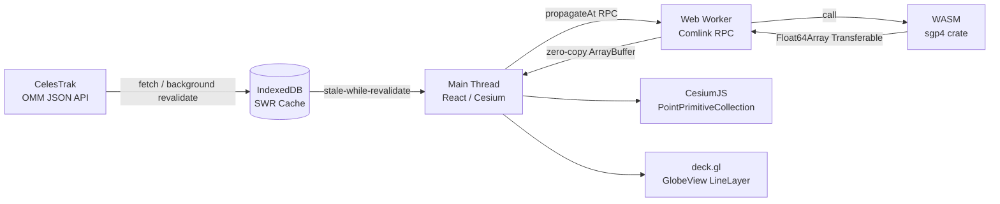

# Orion


Orion is a browser-based real-time space tracking dashboard that renders ~10,000 satellites on a 3D globe at 60 FPS. It ingests CelesTrak OMM JSON (not TLE), propagates orbits in a Rust/WASM Web Worker via the `sgp4` crate, and visualizes results with CesiumJS primitives and a deck.gl orbit-track overlay.

---

## Architecture Overview



Data flows left-to-right: OMM records are fetched from CelesTrak, persisted in IndexedDB with a 2-hour staleness window, deserialized on the main thread, dispatched to a Comlink-wrapped Web Worker, propagated by the Rust SGP4 engine, and returned as a Transferable `Float64Array` (zero copy). The render loop reads positions out of the buffer, applies an ECI→ECEF GMST rotation, and writes directly to `PointPrimitive.position` — bypassing React reconciliation entirely.

---

## Prerequisites

| Requirement | Version | Notes |
|---|---|---|
| Node.js | 22 LTS | `node --version` |
| Rust toolchain | stable | `rustup update stable` |
| wasm-pack | latest | `cargo install wasm-pack` |
| VITE_CESIUM_ION_TOKEN | optional | Enables Cesium Ion imagery; the app works without it using the bundled NaturalEarthII basemap |

---

## Setup

### 1. Clone and install

```bash
git clone https://github.com/d3mocide/Orion
cd Orion
npm install
```

### 2. Build the WASM module

```bash
wasm-pack build wasm-src --target web \
  --out-dir src/features/orbital-mechanics/wasm \
  --no-pack
```

This compiles `wasm-src/` (Rust workspace using the `sgp4` crate) and emits `.wasm` + JS glue into `src/features/orbital-mechanics/wasm/`. WASM artifacts are also committed to git for zero-Rust-toolchain dev environments.

### 3. Start the dev server

```bash
npm run dev
# → http://localhost:5173
```

### 4. Run unit tests

```bash
npm run test          # Vitest — 9/9 passing
```

### 5. Run end-to-end tests

```bash
npx playwright install --with-deps   # first time only
npm run test:e2e
```

### Environment variables

| Variable | Default | Description |
|---|---|---|
| `VITE_CESIUM_ION_TOKEN` | _(none)_ | Cesium Ion access token |

---

## UCS Satellite Database

The [UCS Satellite Database](https://www.ucsusa.org/resources/satellite-database) provides operator, country, and purpose enrichment for each NORAD object. Because the UCS site does not set CORS headers, the CSV cannot be fetched at runtime.

**Current process:**

1. Download the CSV from https://www.ucsusa.org/resources/satellite-database
2. Load it into IndexedDB via `writeCachedUCS(csvText)` in the browser DevTools console, then reload.

> **Status:** In-app CSV upload is planned for a future release. The app is fully functional without it — operator / country / purpose facets in the filter panel will be empty.

---

## Performance

| Metric | Value | Conditions |
|---|---|---|
| 10k SGP4 propagations | ~7–10 ms | Node.js, no WASM SIMD |
| Target frame budget | < 16 ms | 60 FPS |
| Satellite render count | ~10,000 | `PointPrimitiveCollection` |
| Filter visibility toggle | < 1 ms | O(n) loop, no GPU re-upload |

---

## Known Stubs

| Module | File | Status |
|---|---|---|
| SatNOGS RF telemetry | `src/features/telemetry-ingestion/clients/satnogs.ts` | Returns empty array |
| NOAA SWPC space weather | `src/features/space-weather/noaa-spot.ts` | Returns mock Kp=2, F10.7=150 |
| Space-Track.org auth | `src/features/telemetry-ingestion/clients/spacetrack.ts` | Throws "not implemented" |
| UCS CSV enrichment | `src/features/osint-intelligence/` | Requires user-supplied CSV |
| Next visual pass | Detail panel | Placeholder |

---

## Docker

```bash
docker build -t orion .
docker run -p 8080:8080 orion
# → http://localhost:8080
```

The Dockerfile performs a multi-stage build: Rust + wasm-pack in the first stage, `npm run build` in the second, and serves static output with nginx.

---

## Contributing

1. Follow the feature-driven directory layout (`src/features/<feature-name>/`).
2. Hard constraints C1–C8 (see `ARCHITECTURE.md`) must not be violated.
3. All unit tests must pass (`npm run test`) before opening a PR.

## License

MIT © d3mocide
