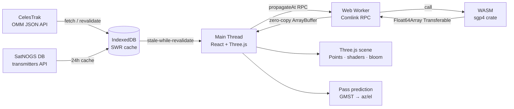

# Orion


Orion is a browser-based satellite tracking instrument for amateur radio operators and orbit watchers. It renders the live CelesTrak catalog (~10,000 objects) on a high-fidelity Three.js globe — day/night terminator, city lights, aurora atmosphere, real sun and moon ephemerides, procedural deep-sky backdrop — and layers the practical tools on top: **pass prediction** for your ground station, **live az/el/range**, and **RF transmitter frequencies** from the SatNOGS DB.

All computation runs in the browser. SGP4 propagation lives in a Rust/WASM Web Worker; rendering is a single WebGL context with one draw call for the whole satellite cloud. There is no backend — the production deployment is one nginx container serving static files.

---

## Architecture Overview



Key design choice: the scene's world frame is **ECI** (z-up). SGP4 output is written straight into the GPU position buffer with zero per-satellite math; the *Earth mesh* rotates by GMST instead. Stars stay fixed (correct), orbit tracks are clean ellipses (correct), and the per-frame hot path is a single Float64→Float32 copy.

When CelesTrak is unreachable (offline demo, air-gapped network), Orion synthesizes a ~1,000-object demo constellation with physically plausible elements so the app always boots into a living sky.

---

## Features

- **Live catalog** — CelesTrak OMM JSON (active, Starlink, OneWeb, GPS, GEO, Iridium NEXT, recent launches), cached in IndexedDB with a 2-hour stale-while-revalidate window
- **10k-object 3D view** — one `THREE.Points` draw call, custom glow shader, colored by orbit regime (LEO teal · MEO violet · GEO magenta · HEO amber), UnrealBloom post-processing
- **High-fidelity Earth** — day/night blend shader with city lights, specular oceans, drifting clouds, aurora-tinted atmosphere; sun and moon placed by real ephemerides; the terminator is where it actually is right now
- **Pass prediction** — set your ground station (manual lat/lon or browser GPS) and get AOS/LOS times, max elevation, azimuths, and closest range for the next 24 h, with a live progress bar during a pass
- **Polar tracking plot** — azimuth/elevation sky chart of the selected pass with AOS/LOS endpoints and a live position dot
- **Doppler shift analysis** — per-pass Doppler curve for any carrier frequency (seeded from SatNOGS downlinks), derived from real range-rate, with CSV export for rig control
- **Apsis markers** — apogee/perigee diamonds with altitude labels rendered on the selected orbit
- **RF frequencies** — SatNOGS DB transmitter records (downlink/uplink, mode, baud, status) per satellite, cached 24 h; click a downlink to feed the Doppler analyzer
- **Time machine** — pause, ×1/×10/×60/×600 simulation speed, jump to now, or set an explicit UTC date/time
- **Search + catalog table** — instant name/NORAD lookup, virtualized 10k-row table
- **UCS enrichment** *(optional)* — operator/country/purpose facets when the UCS Satellite Database CSV is loaded

---

## Prerequisites

| Requirement | Version | Notes |
|---|---|---|
| Node.js | 22 LTS | `node --version` |
| Rust toolchain | stable | only needed to rebuild the WASM module |
| wasm-pack | latest | `cargo install wasm-pack` |

---

## Setup

### 1. Clone and install

```bash
git clone https://github.com/d3mocide/Orion
cd Orion
npm install
```

### 2. Build the WASM module

```bash
rustup target add wasm32-unknown-unknown
wasm-pack build wasm-src --target web \
  --out-dir ../src/features/orbital-mechanics/wasm --no-pack
```

### 3. Start the dev server

```bash
npm run dev
# → http://localhost:5173
```

### 4. Tests

```bash
npm run test       # Vitest unit tests (astro math, pass prediction, parsers)
npm run test:e2e   # Playwright smoke tests (starts the dev server itself)
```

---

## Docker

One container, static files, nginx:

```bash
docker compose up --build
# → http://localhost:8080
```

The multi-stage build compiles the Rust/WASM engine, bundles the frontend, and serves `dist/` from `nginx:alpine`. No runtime services, no tokens, no env vars required.

---

## Ground Station & Pass Prediction

1. Open the **Mission** panel (top-left)
2. Enter lat/lon or hit **Use GPS**
3. Select any satellite — the detail panel now shows live azimuth/elevation/range and the next passes over your horizon

Pass math: ECI sample buffers from the WASM propagator are rotated to ECEF via GMST, converted to topocentric ENU look angles, and scanned for horizon crossings with linear AOS/LOS refinement (a few seconds of accuracy at 30 s steps — fine for VHF/UHF work).

### Accuracy notes

| Quantity | Method | Error budget |
|---|---|---|
| Propagation | `sgp4` crate (verified against reference test vectors) | standard SGP4 (~1 km at epoch, grows with element age) |
| ECI→ECEF | GMST rotation | < 100 m vs full IAU2006 at display scales |
| Observer | WGS84 ellipsoid, geodetic | exact ellipsoid math |
| Velocity readout | vis-viva from mean motion | exact for two-body motion |
| Doppler | central-difference range rate | sub-Hz vs analytic at 2–5 s steps |
| Sub-satellite point | geodetic correction tan φ/(1−e²) | < 0.01° |
| Eclipse flag | cylindrical umbra | penumbra fringe only (~seconds) |
| Sun / Moon position | low-precision ephemerides | ~0.01° / ~0.5° (visual placement) |

---

## UCS Satellite Database

The [UCS Satellite Database](https://www.ucsusa.org/resources/satellite-database) provides operator/country/purpose enrichment. The UCS site doesn't send CORS headers, so the CSV can't be fetched at runtime. Download it manually and load it via `writeCachedUCS(csvText)` in the DevTools console, then reload. The app is fully functional without it.

---

## Performance

| Metric | Value | Conditions |
|---|---|---|
| 10k SGP4 propagations | ~7–10 ms | WASM worker, off the main thread |
| Satellite cloud | 1 draw call | `THREE.Points` + custom shader |
| Per-frame satellite math (main thread) | 0 trig ops | ECI world frame; Earth rotates instead |
| JS bundle (gzip) | ~212 kB | three + react + app |

---

## License

MIT © d3mocide

Earth/moon textures derived from NASA imagery via the [three.js examples](https://github.com/mrdoob/three.js) (public domain sources).
